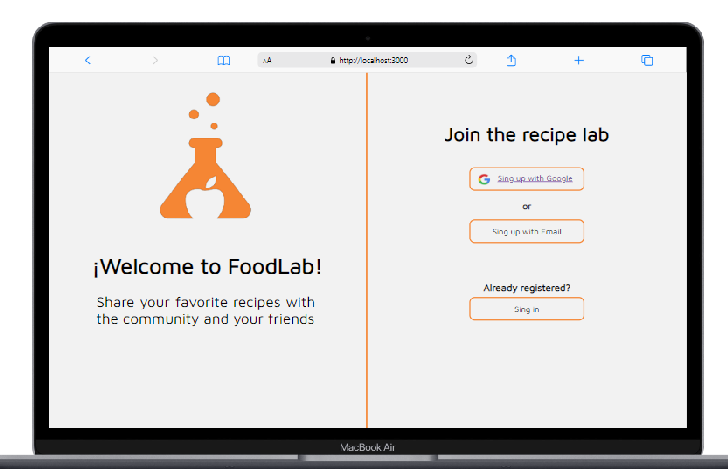
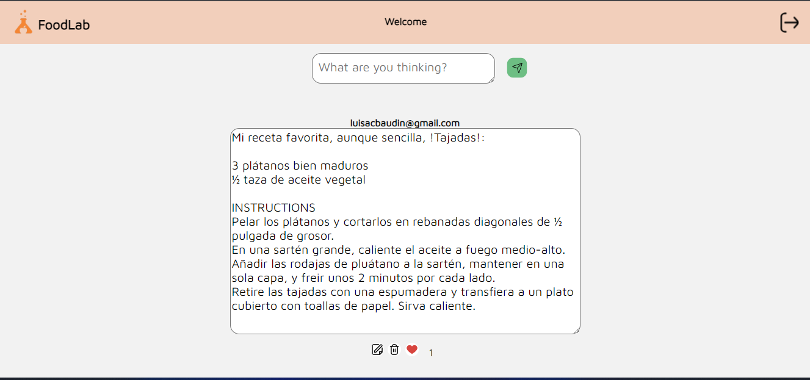

# Creando una Red Social

##  FoodLab - Social Network 

## Resumen del proyecto
FoodLab, es una red social creada para las personas que amen todo lo relacionado con cocinar o comida, ya que aqui podran publicar, editar, eliminar y dar like a todo tipo de recetas. 

## Definición de Usuarios

Esta diseñada para ser utilizada a partir de cualquier edad, no importa sin son niños, adultos, que no sepan o que en su defecto amen cocinar, y que quieran compartir u adquirir conocimientos. 

## Objetivos - Historias de Usuario 

* El usuario, puede escoger con cuales de las opciones puede loguearse. 

* Al hacer el registro, poder dirigirse a la parte del muro. 

* El usuario podra publicar su receta en un post. 

* Podra editarlo, por cualquier situación. 

* Podra eliminarlo

* Podra expresar si le gusta su receta o la de otra persona. 

* Salir de la aplicación 

* Todos estos objetivos en cualquier pantalla. 

## Objetivos-Tech 
* Uso de SPA 
* Vanilla JS
* CSS3 y HTML5
* Jest
* Firebase y Firestore. 
## Prototipos de alta

* Vista responsive

   Click en el enlace a [Figma](https://www.figma.com/proto/gSzT4poOAExyTd7J9ZwhF5/Untitled?node-id=1%3A3&scaling=scale-down&page-id=0%3A1&starting-point-node-id=1%3A3)

* Vista desktop

